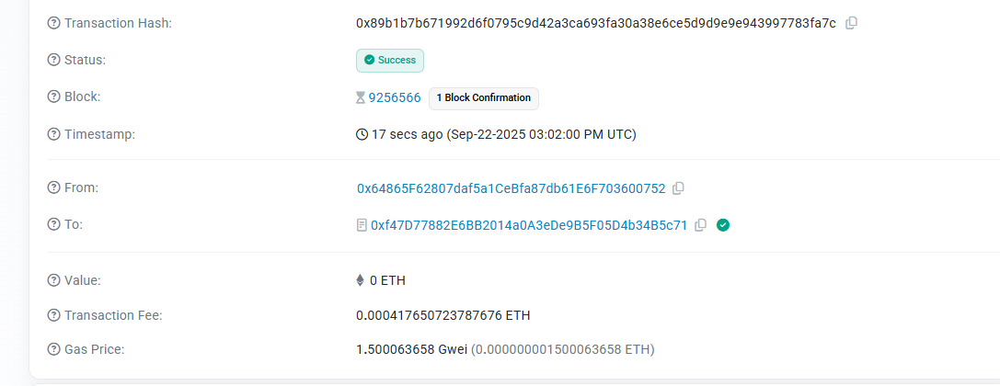

# Privacy Access Control System

## 🔐 Overview

Privacy Access Control System is a cutting-edge blockchain application that implements **confidential permission management** using **Fully Homomorphic Encryption (FHE)** technology. This system enables organizations to manage access rights to sensitive resources while maintaining complete privacy and confidentiality of permission levels and access patterns.

## 🎯 Core Concepts

### Fully Homomorphic Encryption (FHE) Contracts
Our system leverages FHE technology to perform computations on encrypted data without revealing the underlying information. This revolutionary approach ensures that:

- **Access levels remain encrypted** throughout the entire permission verification process
- **Sensitive data never gets exposed** during on-chain operations
- **Privacy is preserved** while maintaining full functionality
- **Zero-knowledge verification** of access rights without revealing permission details

### Confidential Access Control
The system implements a sophisticated **privacy-preserving permission management** framework that includes:

- **Encrypted Resource Management**: Resources are classified with encrypted sensitivity levels
- **Private Permission Requests**: Access requests are processed without exposing requested permission levels
- **Confidential Verification**: Access verification occurs entirely on encrypted data
- **Anonymous Access Patterns**: User access patterns remain completely private

### Privacy-Preserving Permission Management
Our approach to permission management ensures complete confidentiality through:

- **Encrypted Permission Storage**: All permission data is stored in encrypted form
- **Private Access Level Verification**: Verification happens without decrypting sensitive information
- **Confidential Audit Trails**: Access logs maintain privacy while ensuring accountability
- **Secure Multi-Party Computation**: Multiple parties can verify permissions without sharing sensitive data

## 🏗️ Architecture

### Smart Contract Layer
The core FHE-enabled smart contract provides:
- Resource creation with encrypted sensitivity levels
- Private access request processing
- Confidential permission verification
- Encrypted permission management

### Application Layer
- Intuitive web interface for resource and permission management
- Real-time interaction with FHE contracts
- Secure wallet integration
- Privacy-preserving user experience

## ✨ Key Features

### 🔒 Resource Management
- **Create Confidential Resources**: Define resources with encrypted sensitivity classifications
- **Private Resource Registry**: Maintain a registry of resources without exposing their security levels
- **Encrypted Metadata**: Store resource information while preserving confidentiality

### 🔑 Access Request System
- **Anonymous Access Requests**: Request permissions without revealing the requested access level
- **Private Request Processing**: Process requests using FHE without exposing sensitive information
- **Confidential Approval Workflow**: Approve or deny requests while maintaining privacy

### 🛡️ Permission Verification
- **Zero-Knowledge Verification**: Verify access rights without revealing permission details
- **Encrypted Access Levels**: All access level comparisons happen on encrypted data
- **Private Audit Capabilities**: Generate audit logs while preserving user privacy

### 📊 Privacy-Preserving Analytics
- **Confidential Statistics**: Generate usage statistics without exposing individual access patterns
- **Anonymous Reporting**: Create reports that maintain user anonymity
- **Encrypted Metrics**: Track system performance while preserving data confidentiality

## 🌐 Live Demo

**🎬 Demo Video**: [Watch the system in action](PrivacyAccessControl.mp4)

**🖼️ Transaction Screenshots**:

**🌍 Live Application**: [https://privacy-access-control.vercel.app/](https://privacy-access-control.vercel.app/)

## 📋 Contract Information

**📍 Contract Address**: `0xf47D77882E6BB2014a0A3eDe9B5F05D4b34B5c71`

**🌐 Network**: Sepolia Testnet

**🔗 Etherscan**: [View on Sepolia Etherscan](https://sepolia.etherscan.io/address/0xf47D77882E6BB2014a0A3eDe9B5F05D4b34B5c71)

## 🚀 Getting Started

### Prerequisites
- MetaMask or compatible Web3 wallet
- Sepolia testnet ETH for transactions
- Modern web browser with JavaScript enabled

### Using the Application

1. **Connect Your Wallet**
   - Click "Connect Wallet" to link your MetaMask
   - Ensure you're connected to Sepolia testnet
   - The system will automatically detect your network

2. **Create Resources**
   - Define confidential resources with encrypted sensitivity levels
   - Set resource descriptions and privacy classifications
   - Resources are stored with FHE encryption for maximum security

3. **Request Access**
   - Submit access requests for specific resources
   - Request levels are encrypted and processed privately
   - No sensitive information is exposed during the request process

4. **Manage Permissions**
   - Process access requests using confidential evaluation
   - Grant or deny permissions without revealing criteria
   - Maintain complete privacy throughout the approval process

5. **Verify Access**
   - Check access rights using zero-knowledge verification
   - Verify permissions without exposing access levels
   - Maintain audit trails while preserving privacy

## 🔧 Technical Specifications

### Blockchain Technology
- **Smart Contract Platform**: Ethereum (Sepolia Testnet)
- **Encryption**: Fully Homomorphic Encryption (FHE)
- **Privacy Layer**: Zero-knowledge verification protocols
- **Gas Optimization**: Efficient FHE operations

### Security Features
- **End-to-End Encryption**: All sensitive data remains encrypted
- **Privacy Preservation**: No data leakage during computations
- **Audit Trail**: Confidential but verifiable access logs
- **Multi-Layer Security**: Contract-level and application-level protection

### Performance
- **Scalable Architecture**: Supports large-scale permission systems
- **Efficient FHE Operations**: Optimized for practical use cases
- **Real-Time Verification**: Instant access right validation
- **Minimal Gas Costs**: Cost-effective privacy-preserving operations

## 🎯 Use Cases

### Enterprise Security
- **Corporate Data Access**: Manage access to confidential business information
- **Employee Permission Systems**: Control access to various organizational resources
- **Compliance Monitoring**: Maintain audit trails while preserving privacy

### Healthcare Systems
- **Patient Data Protection**: Secure access to medical records
- **Research Data Management**: Confidential access to research datasets
- **Regulatory Compliance**: Meet privacy requirements without sacrificing functionality

### Government Applications
- **Classified Information Access**: Manage access to sensitive government data
- **Citizen Privacy Protection**: Protect individual privacy in government systems
- **Secure Inter-Agency Collaboration**: Enable secure information sharing

### Financial Services
- **Customer Data Protection**: Secure access to financial information
- **Risk Management**: Confidential risk assessment and monitoring
- **Regulatory Reporting**: Generate compliance reports while maintaining privacy

## 🌟 Innovation Highlights

### Breakthrough Technology
- **First-of-its-kind** FHE implementation for access control
- **Revolutionary privacy preservation** in permission management
- **Pioneering zero-knowledge** access verification
- **Industry-leading confidentiality** in blockchain applications

### Real-World Impact
- **Enhanced Privacy**: Unprecedented level of data protection
- **Regulatory Compliance**: Meets strictest privacy requirements
- **Enterprise Adoption**: Ready for large-scale organizational deployment
- **Future-Proof Design**: Built for evolving privacy regulations

## 📈 Roadmap

### Phase 1: Foundation ✅
- Core FHE contract implementation
- Basic privacy-preserving operations
- Web interface development
- Testnet deployment

### Phase 2: Enhancement 🔄
- Advanced FHE operations
- Multi-party computation features
- Enhanced user experience
- Performance optimizations

### Phase 3: Enterprise 🎯
- Mainnet deployment
- Enterprise integrations
- Advanced analytics
- Compliance certifications

## 🤝 Contributing

We welcome contributions to the Privacy Access Control System! Here's how you can get involved:

### Development
- **Code Contributions**: Help improve the FHE implementation
- **Security Auditing**: Review contracts for security vulnerabilities
- **Performance Optimization**: Enhance system efficiency
- **Documentation**: Improve project documentation

### Testing
- **User Testing**: Test the application and report issues
- **Security Testing**: Conduct penetration testing
- **Performance Testing**: Evaluate system performance
- **Compatibility Testing**: Test across different browsers and wallets

### Community
- **Feature Requests**: Suggest new features and improvements
- **Bug Reports**: Report issues and help with debugging
- **Educational Content**: Create tutorials and guides
- **Community Support**: Help other users and developers

## 📞 Support

For questions, issues, or collaboration opportunities:

- **GitHub Issues**: [Report issues and feature requests](https://github.com/EdaNicolas/PrivacyAccessControl/issues)
- **GitHub Repository**: [https://github.com/EdaNicolas/PrivacyAccessControl](https://github.com/EdaNicolas/PrivacyAccessControl)
- **Live Application**: [https://privacy-access-control.vercel.app/](https://privacy-access-control.vercel.app/)

## 🌍 Community

Join our growing community of privacy advocates, blockchain developers, and security professionals who are building the future of confidential computing and privacy-preserving applications.

**Together, we're revolutionizing how the world thinks about privacy, security, and access control in the digital age.**

---

*Privacy Access Control System - Powered by Fully Homomorphic Encryption*